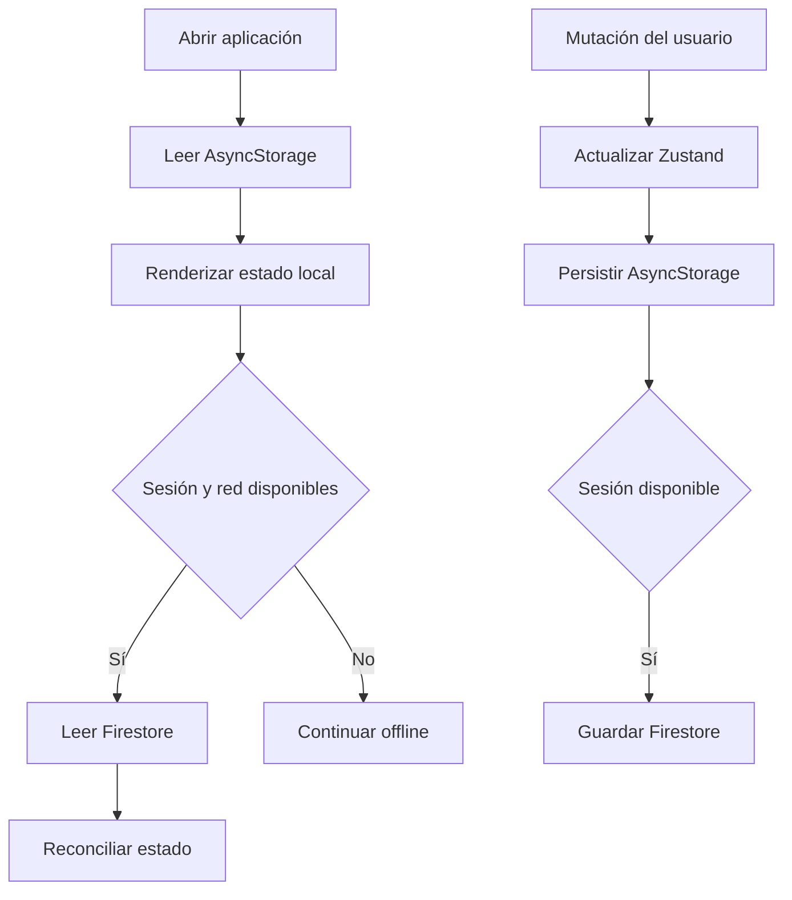

# Arquitectura de SUI

SUI combina una aplicación Expo/React Native y un backend Firebase Functions. La arquitectura prioriza funcionamiento offline, privacidad conversacional, límites claros entre funcionalidades y evolución incremental.

## Vista general

```text
Cliente Expo
├── application: bootstrap y navegación
├── features: funcionalidades de producto
└── shared: UI, infraestructura y dominio compartido
        │
        ├── Firebase Auth y Firestore
        ├── AsyncStorage
        ├── Google Calendar
        └── Firebase Function chatProxy
                └── Azure OpenAI Foundry
```

## Organización del cliente

```text
src/
├── application/
│   ├── App.tsx
│   └── navigation/
├── features/
│   ├── auth/
│   ├── onboarding/
│   ├── chat/
│   ├── home/
│   ├── goals/
│   ├── habits/
│   ├── calendar/
│   └── settings/
└── shared/
    ├── domain/productivity/
    ├── infrastructure/firebase/
    ├── preferences/
    ├── theme/
    ├── types/
    └── ui/
```

### Reglas de dependencia

1. `application` compone navegación, providers y funcionalidades.
2. Una funcionalidad puede depender de `shared`.
3. `shared` no debe importar funcionalidades.
4. Código privado permanece dentro de su funcionalidad.
5. Dependencias entre funcionalidades deben ser explícitas y pequeñas.
6. No se usan barrels globales; los imports apuntan al módulo concreto.

SUI conserva React Navigation con Native Stack y Bottom Tabs. Se evita `src/app` porque Expo la reserva para rutas de Expo Router.

## Dominio de productividad

Metas, hábitos, rachas, XP e historial semanal comparten una única unidad de estado. Por ello viven en `shared/domain/productivity` en lugar de pertenecer al dashboard.

Este dominio contiene:

- Store principal de Zustand.
- Persistencia local y sincronización Firestore.
- Reglas de reset diario.
- Cálculo de XP, niveles, logros y snapshots.
- Eventos de celebración compartidos.

Las pantallas de metas, hábitos, calendario y resumen consumen este dominio sin depender entre sí.

## Flujo offline-first


```mermaid
graph TD
    A[Abrir aplicación] --> B[Leer AsyncStorage]
    B --> C[Renderizar estado local]
    C --> D{Sesión y red disponibles}
    D -- Sí --> E[Leer Firestore]
    E --> F[Reconciliar estado]
    D -- No --> G[Continuar offline]
    H[Mutación del usuario] --> I[Actualizar Zustand]
    I --> J[Persistir AsyncStorage]
    J --> K{Sesión disponible}
    K -- Sí --> L[Guardar Firestore]
```

La UI no espera indefinidamente a la nube. La carga remota tiene timeout y los fallos de sincronización no bloquean el uso local.

## Navegación

- `AppNavigator`: controla onboarding, home, chat, progreso y ajustes.
- `TabNavigator`: compone las cuatro rutas operativas: overview, metas, hábitos y agenda. La acción central SUI abre Chat sin formar parte del estado de tabs.
- El gate inicial depende de la rehidratación del onboarding y del estado de Firebase Auth.
- El splash permanece visible hasta que ambos estados estén listos o alcancen su timeout de seguridad.

## Chatbot

El cliente detecta crisis antes del envío, obtiene un Firebase ID token y abre una conexión SSE al proxy.

El backend separa:

```text
functions/src/
├── index.ts               # Wiring HTTP
└── chat/
    ├── auth.ts            # Verificación de bearer token
    ├── azure.ts           # Cliente upstream
    ├── config.ts          # Parámetros y límites
    ├── firebase.ts        # Firebase Admin
    ├── rateLimit.ts       # Control por UID
    ├── sse.ts             # Normalización del stream
    └── validation.ts      # Validación del payload
```

La clave de Azure nunca se incluye en el bundle móvil. El historial permanece en el dispositivo y se elimina después de 48 horas.

## Decisiones relacionadas

- [Arquitectura orientada por funcionalidad](../decisions/0001-feature-oriented-architecture.md)
- [Conservar React Navigation](../decisions/0002-keep-react-navigation.md)
- [Umbral para adoptar monorepo](../decisions/0003-monorepo-threshold.md)
