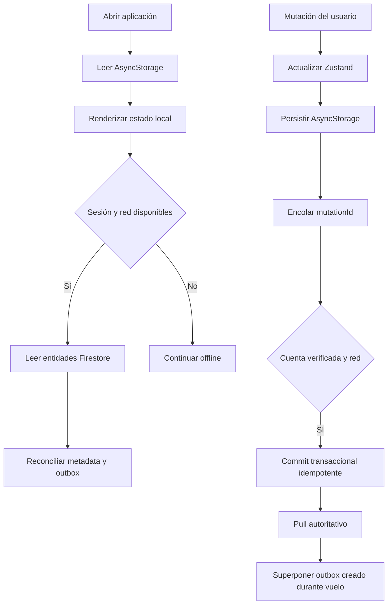

# Arquitectura de Sui

Sui combina cliente Expo/React Native y backend Firebase Functions. Arquitectura prioriza funcionamiento offline, privacidad conversacional, límites claros y evolución incremental.

## Vista general

```text
Cliente Expo
├── application: bootstrap y navegación
├── features: funcionalidades de producto
└── shared: UI, infraestructura y dominio compartido
        │
        ├── Firebase Auth y Firestore por entidad
        ├── AsyncStorage
        └── Firebase Functions
                ├── chatProxy → Azure OpenAI Foundry
                ├── OAuth Google Calendar
                └── eliminación de cuenta
```

## Organización del cliente

```text
src/
├── application/
│   ├── App.tsx
│   └── navigation/
├── features/
│   ├── auth/
│   ├── onboarding/
│   ├── chat/
│   ├── home/
│   ├── goals/
│   ├── habits/
│   ├── calendar/
│   ├── connections/
│   └── settings/
└── shared/
    ├── domain/productivity/
    │   ├── model/
    │   ├── persistence/
    │   ├── store/
    │   ├── sync/
    │   └── public.ts
    ├── infrastructure/firebase/
    ├── navigation/
    ├── account/
    ├── config/
    ├── i18n/
    ├── observability/
    ├── preferences/
    ├── theme/
    ├── types/
    └── ui/
```

### Reglas de dependencia

1. `application` compone navegación, providers y funcionalidades.
2. Cada funcionalidad publica su superficie externa en `public.ts`.
3. Imports externos usan exclusivamente `@/features/<feature>/public`.
4. Imports internos de una misma funcionalidad son relativos.
5. Una funcionalidad puede depender de `shared`, nunca de `application`.
6. `shared` no puede depender de `features` ni `application`.
7. Dependencias entre funcionalidades no pueden formar ciclos.
8. Contratos React Navigation viven en `shared/navigation/types`.
9. Consumidores externos del dominio productividad usan únicamente `@/shared/domain/productivity/public`.
10. Imports internos de productividad son relativos.

`scripts/check-architecture.mjs` aplica estas reglas mediante AST TypeScript,
resuelve aliases e imports relativos y verifica todas las APIs públicas.

Sui conserva React Navigation con Native Stack y Bottom Tabs. Se evita `src/app` porque Expo la reserva para Expo Router.

## Dominio de productividad

Metas, hábitos, rachas, XP e historial semanal comparten una unidad de estado.
Por ello viven en `shared/domain/productivity` en lugar de pertenecer a Inicio.

Este dominio contiene:

- Store principal de Zustand.
- Persistencia local y sincronización Firestore.
- Reglas de reset diario.
- Cálculo de XP, niveles, logros y snapshots.
- Eventos de celebración compartidos.

`public.ts` es su única API externa. `model` contiene reglas puras; `persistence`
administra AsyncStorage y migraciones; `sync` coordina Firestore y conflictos;
`store` adapta dominio a Zustand.

Las pantallas de metas, hábitos, calendario y resumen consumen este dominio sin depender entre sí.

## Flujo local-first


```mermaid
graph TD
    A[Abrir aplicación] --> B[Leer AsyncStorage]
    B --> C[Renderizar estado local]
    C --> D{Sesión y red disponibles}
    D -- Sí --> E[Leer entidades Firestore]
    E --> F[Reconciliar metadata y outbox]
    D -- No --> G[Continuar offline]
    H[Mutación del usuario] --> I[Actualizar Zustand]
    I --> J[Persistir AsyncStorage]
    J --> K[Encolar mutationId]
    K --> L{Cuenta verificada y red}
    L -- Sí --> M[Commit transaccional idempotente]
    M --> N[Pull autoritativo]
    N --> O[Superponer outbox creado durante vuelo]
```

La UI nunca espera nube. Repositorio v8 conserva metadata por entidad, metadata
del resumen, tombstones, outbox y `lastSyncedAt`. Migración lee v7 y luego v6;
v7 permanece como respaldo de solo lectura. Conflictos eligen mayor `revision` y,
en empate, mayor `deviceId` lexicográfico. El reloj cliente no decide. Usuarios
anónimos no escriben productividad en Firestore.

## Navegación

- `AppNavigator`: controla bienvenida, auth, fusión, home, chat, progreso, conexiones y ajustes.
- `TabNavigator`: compone overview, metas, hábitos y agenda. Acción central Sui abre Chat sin formar parte del estado de tabs.
- Gate inicial depende sólo de rehidratar `IntroState`; Firebase no bloquea UI local.
- Splash permanece visible hasta cargar fuentes y estado de entrada.

## Chatbot

El cliente detecta crisis antes del envío, obtiene un Firebase ID token y abre una conexión SSE al proxy.

El backend separa:

```text
functions/src/
├── index.ts               # Wiring HTTP
├── account/               # Eliminación recursiva y Auth
├── connections/           # OAuth PKCE y Calendar
├── http/                  # CORS y App Check
└── chat/
    ├── auth.ts            # Verificación de bearer token
    ├── azure.ts           # Cliente upstream
    ├── config.ts          # Parámetros y límites
    ├── firebase.ts        # Firebase Admin
    ├── rateLimit.ts       # Control por UID
    ├── sse.ts             # Normalización del stream
    └── validation.ts      # Validación del payload
```

La clave de Azure nunca se incluye en el bundle móvil. El historial permanece en el dispositivo y se elimina después de 48 horas.

## Decisiones relacionadas

Producto y UI: [PRD](../product/PRD.md) y [sistema de diseño](../product/DESIGN_SYSTEM.md).

- [Arquitectura orientada por funcionalidad](../decisions/0001-feature-oriented-architecture.md)
- [Conservar React Navigation](../decisions/0002-keep-react-navigation.md)
- [Umbral para adoptar monorepo](../decisions/0003-monorepo-threshold.md)
- [Cuenta local y auth opcional](../decisions/0004-local-account-and-auth.md)
- [Sync local-first versionado](../decisions/0005-versioned-local-first-sync.md)
- [Conexiones externas aisladas](../decisions/0006-external-connections.md)
