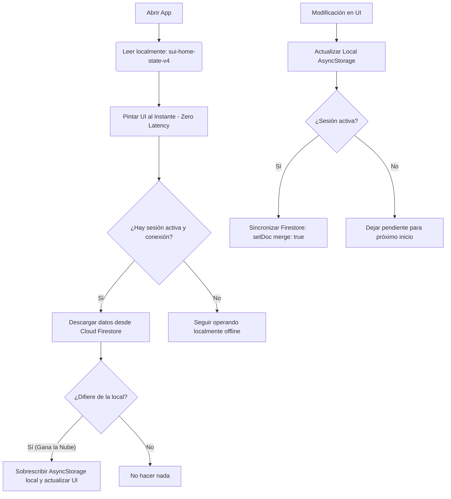
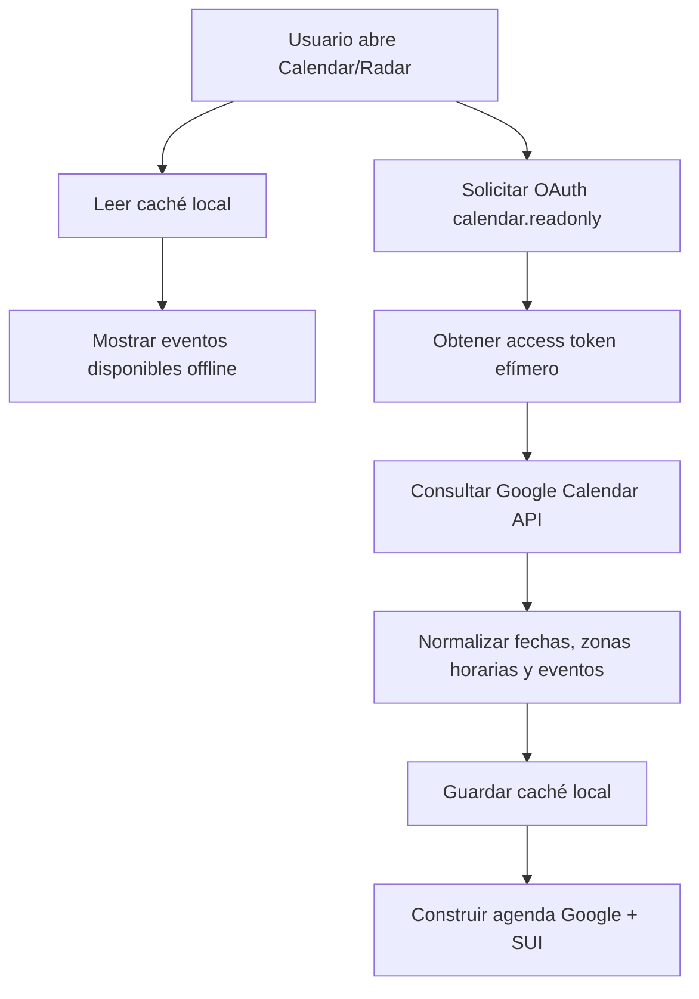

# Arquitectura de Software & Flujos de Datos 🏛️🔄

Este documento profundiza en los principios arquitectónicos, decisiones técnicas y flujos de datos que gobiernan el ecosistema de **SUI-2**. La aplicación móvil está construida sobre un modelo modular, priorizando la resiliencia offline (*offline-first*), la privacidad del usuario, y el control nativo del ciclo de vida del sistema operativo.

---

## 📂 Diseño de Carpetas (Separación de Conceptos)

El proyecto está diseñado bajo un modelo modular estricto que separa la interfaz visual de la lógica de negocio, control de estado y persistencia híbrida:

```bash
/src
├── components/            # UI modular pura sin estado complejo.
│   ├── chat/              # Componentes de interacción con la IA.
│   ├── home/              # Paneles del Dashboard y Listas.
│   └── onboarding/        # Componentes del chat del onboarding conversacional.
├── config/                # Instanciación y exportación de Firebase.
├── context/               # AuthContext (Sesión activa e ID Token).
├── hooks/                 # Custom Hooks: separan el ciclo CRUD de las vistas (useGoals, useHabits).
├── navigation/            # AppNavigator (Enrutamiento por Tunneling de Onboarding).
├── screens/               # Pantallas controladoras y orquestadoras (Home, Onboarding, Chat, etc.).
├── services/              # Clientes de integración externa (SSE stream, Firestore, crisisConfig).
├── store/                 # Centrales de Zustand para gestión de estado de alto rendimiento.
├── types/                 # Tipos compartidos de TypeScript y validadores Zod.
└── theme/                 # theme.ts: Tokens de diseño unificados en Material Design v3.
```

---

## 🔄 Flujo de Datos Híbrido (Offline-First)

Para asegurar que el usuario experimente una carga instantánea (latencia cero) al abrir el Dashboard, la aplicación utiliza una **estrategia de sincronización transparente en dos capas**:


```mermaid
graph TD;
    A[Abrir App] --> B(Leer localmente: sui-home-state-v4)
    B --> C[Pintar UI al Instante - Zero Latency]
    C --> D{¿Hay sesión activa y conexión?}
    D -- Sí --> E[Descargar datos desde Cloud Firestore]
    E --> F{¿Difiere de la local?}
    F -- Sí (Gana la Nube) --> G[Sobrescribir AsyncStorage local y actualizar UI]
    F -- No --> H[No hacer nada]
    D -- No --> I[Seguir operando localmente offline]
    
    J[Modificación en UI] --> K[Actualizar Local AsyncStorage]
    K --> L{¿Sesión activa?}
    L -- Sí --> M[Sincronizar Firestore: setDoc merge: true]
    L -- No --> N[Dejar pendiente para próximo inicio]
```

*   **AsyncStorage (Capa de Presentación Inmediata):** Al cargar el componente `HomeScreen`, el estado se extrae de inmediato de la memoria del teléfono. Esto evita spinners de carga persistentes.
*   **Firestore Sync (Capa de Respaldo Transparente):** El backend en la nube se ejecuta de manera asíncrona. Si existe una diferencia horaria u operativa, los datos de Firestore reemplazan con suavidad a los locales. Cualquier actualización (ej. marcar una meta como completada) se escribe en ambas capas simultáneamente.

---

## 🗓️ Google Calendar y agenda unificada

Calendar/Radar integra eventos de Google Calendar con metas y hábitos SUI sin convertir los eventos externos en tareas editables dentro de la app.

### Flujo de datos


```mermaid
graph TD
    A[Usuario abre Calendar/Radar] --> B[Leer caché local]
    B --> C[Mostrar eventos disponibles offline]
    A --> D[Solicitar OAuth calendar.readonly]
    D --> E[Obtener access token efímero]
    E --> F[Consultar Google Calendar API]
    F --> G[Normalizar fechas, zonas horarias y eventos]
    G --> H[Guardar caché local]
    H --> I[Construir agenda Google + SUI]
```

Principios:

1. La autorización de Google Calendar es independiente del `id_token` usado para Firebase Auth.
2. La primera versión solicita solo lectura (`calendar.readonly`).
3. El access token no se persiste en AsyncStorage.
4. La caché no crea eventos demo y muestra su fecha de última sincronización.
5. Si falla la red, se conserva la última caché y se informa al usuario.
6. La agenda ordena por timestamps normalizados, no por texto visible `AM/PM`.

---

## 🗺️ Estructura de Navegación Desacoplada & Adaptabilidad (Safe Areas)

Para ofrecer una experiencia de usuario impecable (UX premium), similar a la de las aplicaciones nativas más robustas, la navegación de la aplicación principal ha sido refactorizada para desacoplarse del flujo general de ScrollView:

### 1. Desacoplamiento de la Barra de Navegación (`DashboardNavbar`)
Anteriormente, el selector de pestañas residía dentro de la vista principal con scroll. Esto causaba fatiga visual y obligaba al usuario a deslizarse hacia arriba para cambiar de sección. Ahora, `DashboardNavbar` es una capa flotante de posición fija al borde inferior de la pantalla. Esto garantiza que las secciones críticas (**Overview**, **Metas**, **Hábitos**, **Calendar/Radar**) estén siempre accesibles con un solo toque desde cualquier pantalla.

### 2. Integración de Insets de Safe Area (`react-native-safe-area-context`)
Diferentes terminales móviles tienen configuraciones físicas de pantalla muy distintas (por ejemplo, el "Notch" de iOS, los bordes curvos o los "Home Indicators" de deslizamiento nativo). 
*   **Ajuste Dinámico:** La aplicación utiliza `useSafeAreaInsets` de forma estratégica en el componente orquestador `HomeScreen` y el componente visual `DashboardNavbar`.
*   **Prevención de Solapamientos:** En lugar de forzar paddings fijos que se verían desproporcionados en terminales antiguos, el sistema calcula el padding inferior nativo sumándolo a la altura estándar de la barra de navegación:
    ```typescript
    const insets = useSafeAreaInsets();
    const dynamicBarHeight = NAV_BAR_HEIGHT + insets.bottom;
    ```
    Esto empuja suavemente el contenido de las listas y el botón de acción flotante (FAB) **"Hablar con SUI"** por encima de los límites físicos reales del dispositivo, garantizando que ningún botón o texto sea tapado por el indicador nativo del sistema operativo.

### 3. Iconografía Consistente con `@expo/vector-icons` (Feather)
Se ha integrado la suite `@expo/vector-icons` para proveer consistencia visual en toda la aplicación. SUI-2 adopta de manera estricta la familia de iconos **Feather** por su estilo minimalista, lineal, con grosores de trazo equilibrados (strokeWidth de 2) que encajan perfectamente con el minimalismo y sobriedad de Material Design v3.
