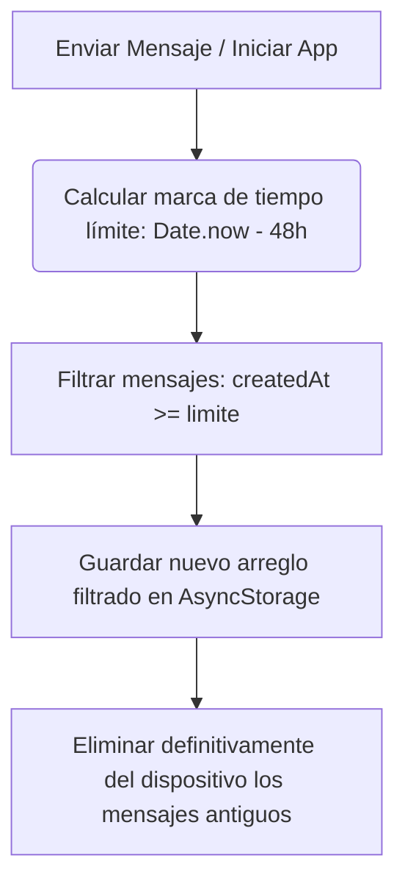
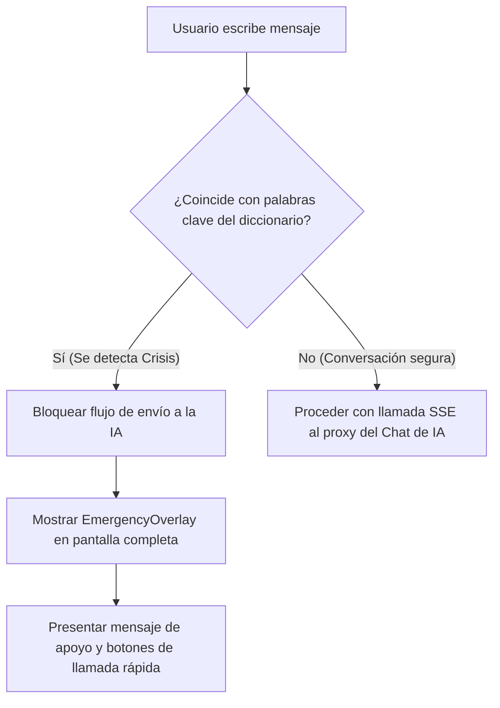

# Privacidad Local-First & Protocolo de Crisis 🛡️🚨

La salud mental y el bienestar emocional de los estudiantes universitarios requiere un estándar de confidencialidad absoluto. Este documento explica las decisiones de ingeniería detrás del **flujo local de datos conversacionales** y la arquitectura de protección inmediata (Protocolo de Crisis) implementada en SUI-2.

---

## 🔒 Privacidad Local-First y Auto-limpieza (48h TTL)

A diferencia de los asistentes comerciales tradicionales de IA que almacenan de forma permanente las conversaciones en la nube, SUI-2 utiliza una **política estricta de aislamiento de datos sensibles**:

*   **Cero persistencia en la nube para Chat:** El historial de conversaciones **nunca** se respalda en Firebase Cloud Firestore ni en bases de datos externas. No existen tablas de chat en el servidor.
*   **Persistencia Temporal Local:** El historial conversacional reside únicamente en el almacenamiento local del dispositivo del usuario (`AsyncStorage` en la app móvil bajo la clave `sui-chat-v1`).
*   **Auto-limpieza Activa (TTL de 48 Horas):** El store de Zustand implementa una rutina automática de descarte (`pruneExpired`). Cada vez que la aplicación se inicia o que el usuario envía un nuevo mensaje, el sistema analiza el timestamp de cada elemento y elimina de manera definitiva cualquier mensaje cuya antigüedad sea superior a 48 horas (`CHAT_TTL_MS = 172800000`).



---

## ⚠️ Protocolo de Detección de Crisis (Intervención Local)

Para garantizar la seguridad física y emocional de los estudiantes en situaciones de alta criticidad (manifestación de ideaciones suicidas, autolesión u otras crisis de salud mental), la aplicación cuenta con un protocolo preventivo de doble validación:

### 1. Validación Previa en el Cliente (Regex Robustas)
Antes de despachar cualquier entrada de texto libre hacia el backend proxy de OpenRouter, el cliente móvil evalúa el mensaje de forma síncrona:

*   **Normalización Estricta:** Se eliminan mayúsculas, acentos, diacríticos y caracteres especiales para evitar evasiones de coincidencia (ej. `"SUICIDARME"`, `"suícidarmé"` y `"s-u-i-c-i-d-a-r-m-e"` son convertidos a una base común normalizada).
*   ** Regex de Frontera de Palabra:** Se compila dinámicamente un RegExp utilizando límites de palabra (`\b` o exclusión de letras unicode `[^\p{L}]`). Esto evita falsos positivos parciales (ej. evitar que la palabra `"matarme"` se active erróneamente con `"matarmela"` en otros contextos o modismos).

### 2. Diccionario Dinámico de Emergencia
*   **Sincronización:** Al abrir la pantalla de chat, `ChatScreen` descarga asíncronamente el diccionario de palabras críticas y contactos telefónicos desde el documento `app_config/crisis` en Firestore.
*   **Resiliencia Offline:** Si el usuario no cuenta con cobertura de red o la base de datos Firestore está inactiva, la función captura el error de forma segura y carga el `DEFAULT_CRISIS_CONFIG` (diccionario local de respaldo). **El protocolo de emergencia nunca puede fallar por falta de red**.



---

## 📱 Interfaz de Emergencia (Emergency Overlay)

El componente `EmergencyOverlay.tsx` se superpone por completo a la conversación de chat e interrumpe cualquier petición asíncrona en curso. Sus especificaciones de diseño son:

1.  **Copia Empática:** Presenta un mensaje claro, cercano, diseñado por psicólogos para calmar la ansiedad inmediata del estudiante.
2.  **Enlace Telefónico Directo (Linking API):** Expone botones interactivos para llamar de forma inmediata a los números de ayuda locales (ej. emergencias 911, Cruz Roja). Utiliza el esquema nativo de llamadas móviles:
    ```typescript
    import { Linking } from 'react-native';
    
    const handleCall = (phone: string) => {
      Linking.openURL(`tel:${phone}`).catch(() => {
        Alert.alert('Error', 'No se puede iniciar la llamada en este dispositivo.');
      });
    };
    ```
3.  **Botón de Descarte:** Permite cerrar el modal solo si el usuario confirma que se encuentra en un espacio seguro, retornándolo a la pantalla inicial del Dashboard para evitar que continúe ingresando mensajes de ideación de forma repetida al proxy de IA.
